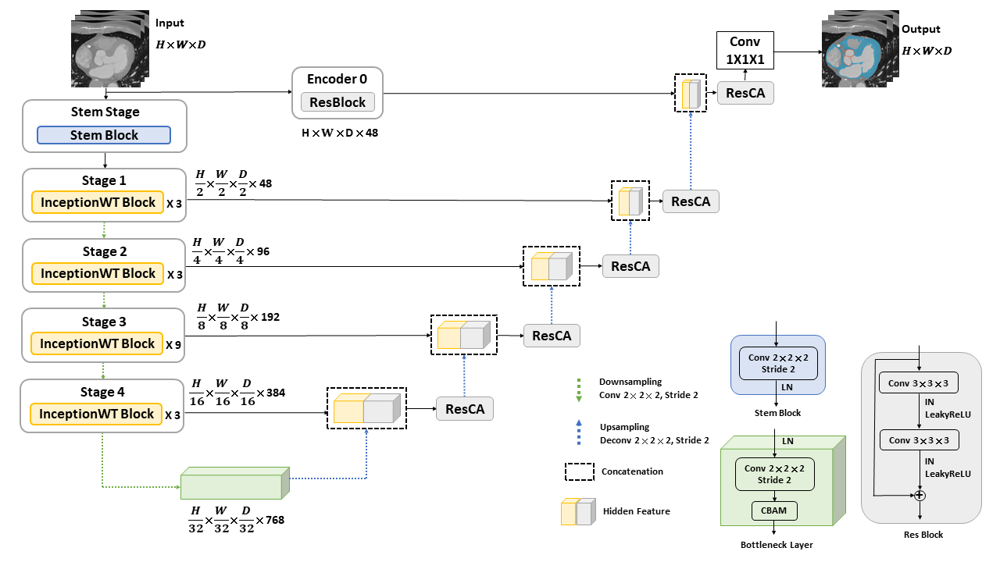

# Frequency Domain and Spatial Domain Fusion Image Segmentation

<br>
<div align="center">
    
</div>
<br><br>


## Abstract
Cardiac anatomical structures are highly complex, and the low contrast of computed tomography images makes accurate segmentation of the myocardium and aortic valve a challenging task. Existing U-Net-based architectures often lose high-frequency boundary information during successive downsampling operations. To address this issue, this study proposes UNetWIC, a novel dual-stream architecture that effectively preserves fine anatomical details.
The encoder adopts the InceptionWT block, which consists of two branches. The spatial branch employs InceptionNeXt with large-kernel convolutions to capture global features, while the frequency branch utilizes wavelet convolution to decompose features through discrete wavelet transform and generate frequency-aware attention maps to further enhance spatial features. The decoder integrates a residual coordinate attention block to progressively refine features and accurately guide spatial reconstruction. This strategy not only effectively restores fine anatomical structures but also ensures precise boundary delineation.
Five-fold cross-validation was conducted on the M-WHS-100 and MM-WHS datasets. Experimental results demonstrate that UNetWIC outperforms existing state-of-the-art models across multiple evaluation metrics, particularly in the segmentation of fine anatomical structures, thereby demonstrating its high segmentation accuracy for clinical applications.

## Approach
We propose **UNetWIC**, a dual-domain fusion network for 3D medical image segmentation. To prevent boundary detail loss during downsampling, we integrate the **InceptionWT** block into the encoder to extract high-frequency wavelet features. Additionally, we incorporate the **ResCA** block into the decoder to enhance 3D spatial coordinate perception.

## Setup
### 1. Create environment
```bash
git clone https://github.com/meimei-lin/CardiacSegV3.git
cd CardiacSegV3
conda create -n CardiacSegV3 python=3.9
conda activate CardiacSegV3
pip3 install torch torchvision torchaudio --index-url https://download.pytorch.org/whl/cu124
pip install tabulate==0.9.0
pip install -r requirements.txt
python setup_dir.py
pip install git+https://github.com/deepmind/surface-distance.git
pip install PyWavelets
```


### 2. Dataset Configuration
* Dataset Paths (on A6000)Cheng Hsin General Hospital (CHGH) Dataset:E:\nfs\Workspace\CardiacSegV2\dataset\chgh\aicup_test  
Fudan University (MMWHS2) Dataset:E:\nfs\Workspace\CardiacSegV2\dataset\mmwhs2\mmwhs_new20  

* 5-Fold JSON Dictionaries SetupBefore training, place the configured .json split files into their respective dataset directories:  Path Examples:
E:\nfs\Workspace\CardiacSegV2\exps\data_dicts\chgh\
E:\nfs\Workspace\CardiacSegV2\exps\data_dicts\mmwhs2\  

* JSON Config Example (exp_60_20_20_fold1.json):Each fold needs to specify which records are used for train, val, and test. Enter the relative paths for the CT images and annotations:
```bash
{
  "test": [
     { "image": "patient0001.nii.gz",
      "label": "patient0001_gt.nii.gz"
     },
    ],
  "train": [
      { "image": "patient0041.nii.gz",
        "label": "patient0041_gt.nii.gz"
      },
     ], 
"val": [
      { "image": "patient0021.nii.gz",
        "label": "patient0021_gt.nii.gz"
      },
    ]
}
```

### 3. Training Notebook Syntax Check (exp_*.ipynb)
Verify the following in cells like Train UNETCNX, Train TestNet, and Train other models:

Initial Syntax: Must use !set PYTHONPATH.

```bash
!set PYTHONPATH={workspace_dir} && \
python {workspace_dir}/expers/tune.py \
Quotation Marks: Parameter values must use double quotes " ".
```
```bash
--optim="AdamW" \
--infer_post_process \
--save_eval_csv
```

### 4. Inference Notebook Syntax Check (infer_*.ipynb)

Python Path Import Fix:

```bash
# Original: sys.path.append(workspace_dir)
# Change to:
sys.path.insert(0, workspace_dir)
```
Python Script Execution Fix:
```bash
# Original: !/opt/conda/bin/python /nfs/Workspace/.../infer.py \
# Change to:
!python {workspace_dir}/expers/infer.py \
```
### 5. Model Training
* Taking the CHGH dataset (exps/exp_chgh.ipynb) as an example:

Open exps/exp_chgh.ipynb and select the Python environment (e.g., CardiacSegV2 or CardiacSegV3).

Run the environment setup cells:

Execute %load_ext autoreload and !nvidia-smi (ensure a green checkmark appears).

Modify parameters in the Setup config cell:
```bash
model_name = 'unetwic'          # The model to run (refer to comments)
exp_name = 'exp_60_20_20_fold1'             # Name for this fold's experiment
data_dict_file_name = 'exp_60_20_20_fold1.json'  # The JSON split file used for this fold
```
Run the corresponding training cell (e.g., Train UNETCNX or Train other models).

[!NOTE]

With batch_size=1 and 9 training cases, it takes approximately 6 to 10 hours to complete on the A6000.

If you want to save these metrics as a .csv file, enable the --save_eval_csv parameter before running.

After running the 5 folds for a model sequentially, you can use Excel to calculate the average and standard deviation.

### 6. Model Inference
* Taking the CHGH dataset (exps/infer_chgh.ipynb) as an example:

Open exps/infer_chgh.ipynb.

Run the environment setup cells (e.g., !nvidia-smi).

Modify parameters in the Infer configuration cell:
```bash
model_name = 'unetwic'            # Model name
exp_name = 'exp_60_20_20_fold1'            # Experiment name (determines which experiment's weights to use)
data_dict_file_name = 'exp_60_20_20_fold1.json'

pid = 'patient0001'                     # The specific patient ID to infer
```
Run the inference cell (Infer UNETCNX and other). Wait for about 1 minute to get the scores. If you have multiple records, repeat the inference steps, record the data, and calculate the average using Excel.
