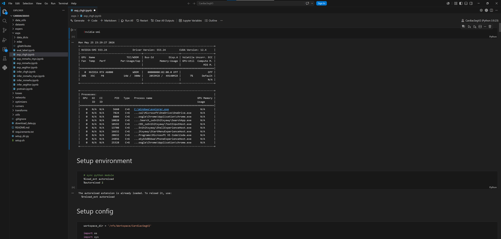
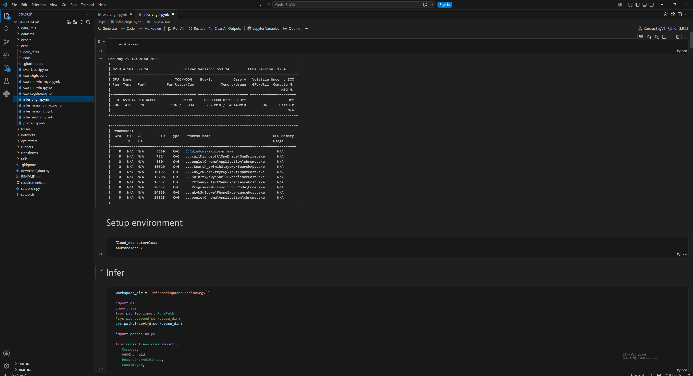

# Frequency Domain and Spatial Domain Fusion Image Segmentation

<br>
<div align="center">
    
</div>
<br><br>


## Abstract
Due to complex cardiac anatomy and low image contrast, accurate segmentation of the myocardium and aortic valve in computed tomography (CT) images remains a major challenge. Current mainstream U-Net-based structures often lose high-frequency boundary information during continuous downsampling. To address this issue, this study proposes a new model WIC-Net, a novel dual-stream architecture that effectively preserves fine anatomical details. Regarding the model design, the encoder employs the InceptionWT block, which combines two branches: the spatial branch utilizes InceptionNeXt with large-kernel convolutions to capture global features, while the frequency branch adopts Wavelet Convolutions (WTConv). WTConv decomposes features via Discrete Wavelet Transform (DWT) and generates a frequency-aware attention map to further enhance the spatial features. The decoder integrates the Residual Coordinate Attention (ResCA) block to progressively refine feature representations and accurately guide spatial reconstruction. This strategy not only effectively recovers micro-structures but also ensures precise boundary delineation. This study evaluated the proposed model using five-fold cross-validation on both the M-WHS 2025 and MM-WHS datasets. Experimental results show that WIC-Net achieves superior performance compared to existing state-of-the-art models across several key metrics, demonstrating remarkable advantages particularly in the segmentation of small structures. This fully proves its highly accurate segmentation capabilities for clinical applications.

## Approach
We propose **WIC-Net**, a dual-domain fusion network for 3D medical image segmentation. To prevent boundary detail loss during downsampling, we integrate the **InceptionWT** block into the encoder to extract high-frequency wavelet features. Additionally, we incorporate the **ResCA** block into the decoder to enhance 3D spatial coordinate perception.

## Setup
### 1. Create environment
```bash
git clone https://github.com/meimei-lin/CardiacSegV3.git
cd CardiacSegV3
conda create -n CardiacSegV3 python=3.9
conda activate CardiacSegV3
pip3 install torch torchvision torchaudio --index-url https://download.pytorch.org/whl/cu124
pip install tabulate==0.9.0
pip install -r requirements.txt
python setup_dir.py
pip install git+https://github.com/deepmind/surface-distance.git
pip install PyWavelets
```


### 2. Dataset deployment
Cheng Hsin General Hospital Dataset: Place the dataset in .\CardiacSeg\dataset\chgh

Fudan University Dataset: Place the dataset in .\CardiacSeg\dataset\mmwhs

### 3. Train
Open /exps/exp_chgh.ipynb or /exps/exp_mmwhs_myo.ipynb
<br>
<div align="center">
    
</div>
<br><br>


### 4. Infer
Open /exps/infer_chgh.ipynb or /exps/infer_mmwhs_myo.ipynb
<div align="center">
    
</div>
<br><br>
